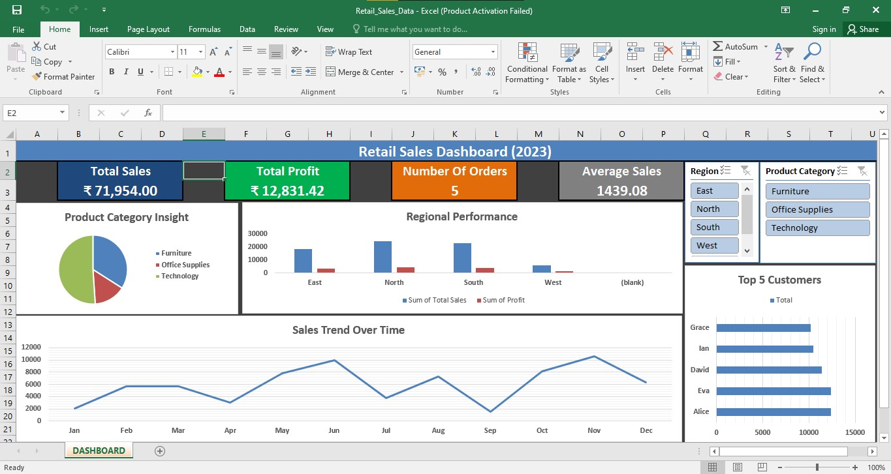

# Retail Sales Dashboard (Excel)

## 📊 Project Overview
This project is an **interactive Excel Dashboard** built on a sample Retail Sales dataset.  
It simulates real-world business reporting where a manager needs quick insights into sales, profit, and customer performance.

The dashboard answers key business questions:
- 📈 What are the total sales, profit, and number of orders?
- 🌍 Which region performs best in terms of sales and profit?
- 🛒 Which product categories and products drive the most revenue?
- 👥 Who are the Top 5 customers?
- 📅 What are the monthly sales trends?

---

## 🛠 Tools & Techniques Used
- **Microsoft Excel**
  - PivotTables
  - PivotCharts
  - KPIs (Total Sales, Profit, Orders, Avg. Sales per Order)
  - Interactive Slicers (Region, Product Category)
  - Dashboard Layout & Formatting

---

## 🚀 How to Use
1. Download the Excel file from this repository:
   - `Retail_Sales_Dashboard.xlsx`
2. Open it in Excel (2016 or later recommended).
3. Explore:
   - Use slicers to filter by *Region* and *Product Category*.
   - View KPIs and charts updating dynamically.

---

## 📷 Dashboard Preview

---

## 💡 Insights
- The dashboard highlights **Top Regions** and **Top Customers**.
- Provides a clear **sales trend over months**.
- Identifies **high-profit vs low-profit categories**.

---

## 📌 Project Value
This project demonstrates skills in:
- Data Cleaning & Structuring
- PivotTable Analysis
- Dashboard Design
- Business Storytelling with Data

---

👨‍💻 *Author: [Your Name]*  
📅 *Year: 2023*  
